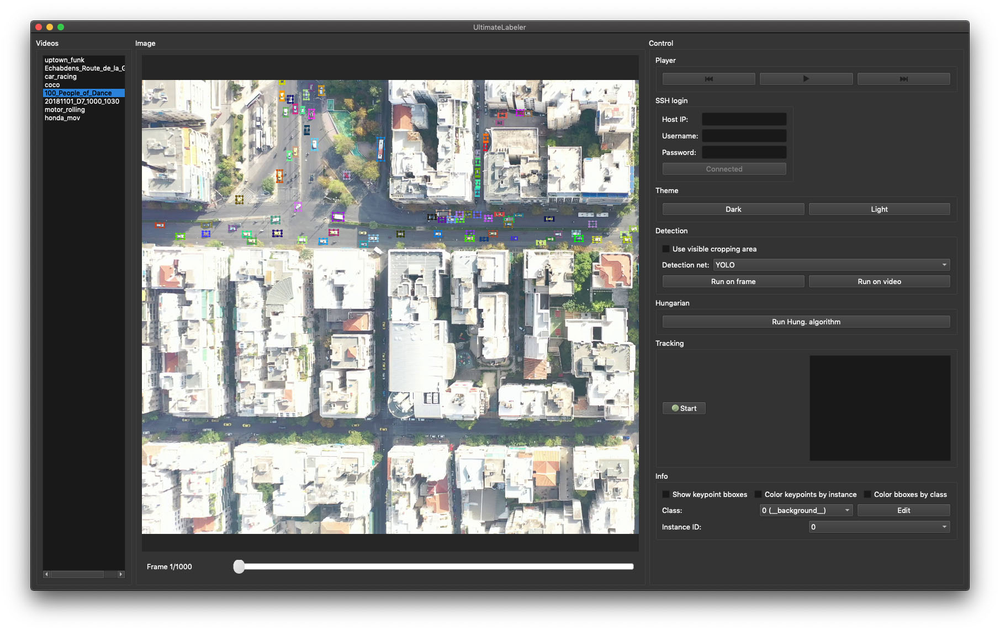
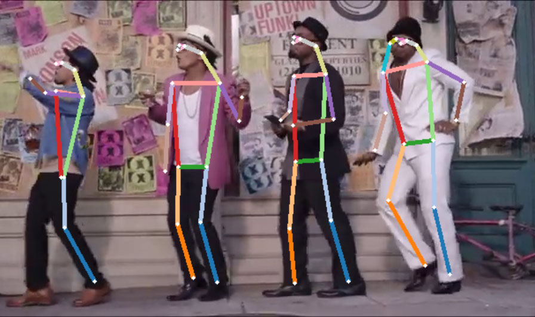
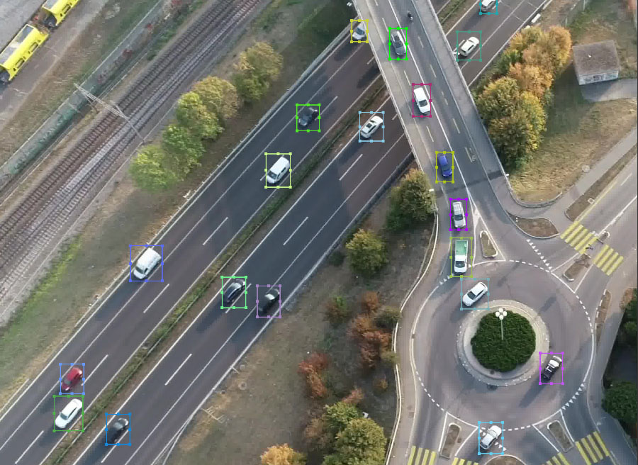
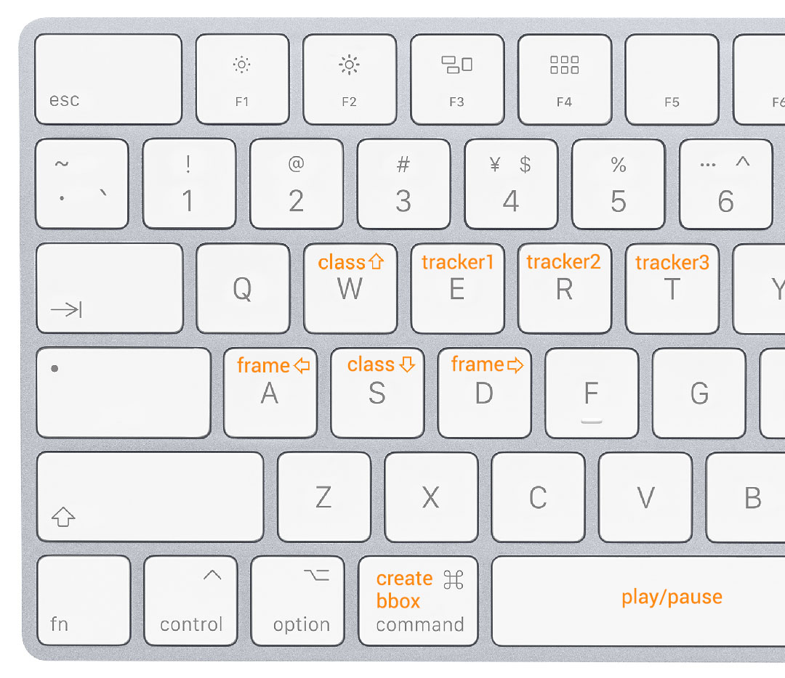

# UltimateLabeling


[](https://opensource.org/licenses/MIT)
[](https://pypi.python.org/pypi/ultimatelabeling)
[](https://pypi.python.org/pypi/ultimatelabeling) 


A multi-purpose Video Labeling GUI in Python with integrated SOTA detector and tracker. Developed using PyQt5.

## Features
- SSH connection to a remote GPU server (see below to configure the server)
- YOLO and OpenPifPaf integrated object & pose detectors (single frame/video mode)
- Hungarian algorithm for track_id assignment
- SiamMask visual object tracking for missing or mislabeled boxes
- Zoom on video, resizable bounding boxes and skeletons
- Dark mode!

## Demo 


 


The integrated object detectors and trackers are based on the following codes:
- [OpenPifPaf](https://github.com/vita-epfl/openpifpaf): for human pose estimation
- [YOLO darknet](https://github.com/AlexeyAB/darknet): for object detection
- [SiamMask](https://github.com/foolwood/SiamMask): for visual object tracking
- [Hungarian algorithm (scipy.optimize)](https://github.com/scipy/scipy): for optimal instance ID assignment


## Installation

Start by cloning the repository on your computer:
```bash
git clone https://github.com/alexandre01/UltimateLabeling.git
cd UltimateLabeling
```

We recommend installing the required packages in a virtual environment to avoid any library versions conflicts. The following will do this for you:
```bash
virtualenv --no-site-packages venv
source venv/bin/activate
pip install -r requirements.txt
```

Otherwise, just install the requirements on your main Python environment using `pip` as follows:
```bash
pip install -r requirements
```

Finally, open the GUI using: 
```bash
python -m ultimatelabeling.main
```

## Remote server configuration
To configure the remote GPU server (using the code in [server files](https://github.com/alexandre01/UltimateLabeling_server).), follow the steps below:

```bash
git clone https://github.com/alexandre01/UltimateLabeling_server.git
cd UltimateLabeling_server
pip install -r requirements.txt
bash siamMask/setup.sh
bash detection/setup.sh
```

The data images and videos should be placed in the folder `data`, similarly to the client code.

To extract video files, use the following script:

```bash
bash extract.sh data/video_file.mp4
```


## Input / output

To start labeling your videos, put these (folder of images or video file, the frames will be extracted automatically) inside the `data` folder. 

- Import labels: To import existing .CSV labels, hit `Cmd+I` (or `Ctrl+I`). UltimateLabeling expects to read one .CSV file per frame, in the format: "class_id", "xc", "yc", "w", "h".

- Export labels: The annotations are internally saved in the `output` folder. To export them in a unique .CSV file, hit `Cmd+E` (or `Ctrl+E`) and choose the destination location.

If you need other file formats for your projects, please write a GitHub issue or submit a Pull request.


## Shortcuts / mouse controls



Keyboard:
- A (or Left key): next frame
- D (or Right key): previous frame
- W/S: class up/down
- T: start/stop tracking (last used tracker)
- Numberpad: assign given class_id
- Spacebar: play the video


Mouse:
- Click: select bounding box
- Click & hold: move in the image
- Cmd + click & hold: create new bounding box
- Right click: delete bounding box in current frame (+ in all previous / all following frames if the corresponding option is enabled)
- Scroll wheel (or swipe up/down): zoom in the image 


## Improvements / issues
Please write a GitHub issue if you experience any issue or wish an improvement. Or even better, submit a pull request! 

## Licence
Copyright (c) 2019 Alexandre Carlier, released under the MIT licence.
